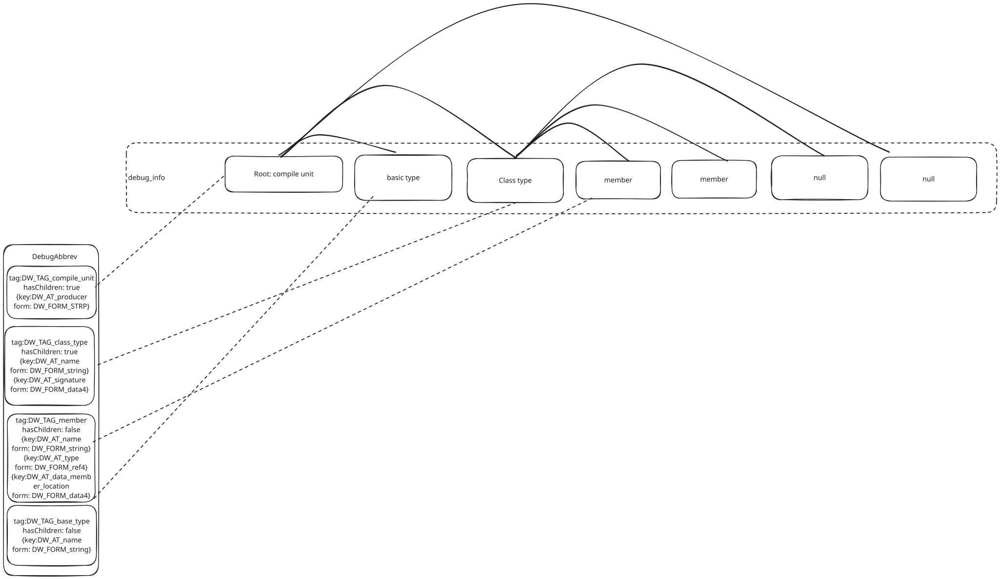

# Debug symbol layout

<p style="display: flex; gap: 10px;">
  
  
</p>

Currently debug symbols has two parts:

1. typescript source map file, which represents the mapping between source code and bytecode, this part is carried over from assemblyscript
2. Dwarf, which represents the class information, variable information.
   They are in following Wasm custom sections sections.
   - debug_info
   - debug_abbrev
   - debug_str

## Debug Abbreviation Definitions

### tag: DW_TAG_compile_unit

**hasChildren:** true

- `DW_AT_producer` -> `DW_FORM_strp`

### tag: DW_TAG_class_type

**hasChildren:** true

- `DW_AT_name` -> `DW_FORM_string`
- `DW_AT_byte_size` -> `DW_FORM_data4`
- `DW_AT_signature` -> `DW_FORM_data4` (runtime type ID)

### tag: DW_TAG_member

**hasChildren:** false

- `DW_AT_name` -> `DW_FORM_string`
- `DW_AT_type` -> `DW_FORM_ref4` (reference to type DIE)
- `DW_AT_data_member_location` -> `DW_FORM_data4` (offset in bytes)

### tag: DW_TAG_base_type

**hasChildren:** false

- `DW_AT_name` -> `DW_FORM_string`
- `DW_AT_byte_size` -> `DW_FORM_data1`

### tag: DW_TAG_template_type_parameter

**hasChildren:** false

- `DW_AT_type` -> `DW_FORM_ref4` (reference to type DIE)

### tag: DW_TAG_variable (Global)

**hasChildren:** false

- `DW_AT_name` -> `DW_FORM_string`
- `DW_AT_type` -> `DW_FORM_ref4` (reference to type DIE)
- `DW_AT_location` -> `DW_FORM_data4` (final Wasm global index)

### tag: DW_TAG_variable (Local, Wasm local)

**hasChildren:** false

- `DW_AT_name` -> `DW_FORM_string`
- `DW_AT_type` -> `DW_FORM_ref4` (reference to type DIE)
- `DW_AT_location` -> `DW_FORM_data4` (Wasm local index)

### tag: DW_TAG_variable (Local, closure-captured)

**hasChildren:** false

- `DW_AT_name` -> `DW_FORM_string`
- `DW_AT_type` -> `DW_FORM_ref4` (reference to type DIE)
- `DW_AT_data_member_location` -> `DW_FORM_data4` (offset inside closure environment tuple)
- `DW_AT_location` -> `DW_FORM_data4` (Wasm local index of the tuple storage)

### tag: DW_TAG_formal_parameter

**hasChildren:** false

- `DW_AT_name` -> `DW_FORM_string`
- `DW_AT_type` -> `DW_FORM_ref4` (reference to type DIE)
- `DW_AT_location` -> `DW_FORM_data4` (Wasm location index)

### tag: DW_TAG_formal_parameter (closure-captured)

**hasChildren:** false

- `DW_AT_name` -> `DW_FORM_string`
- `DW_AT_type` -> `DW_FORM_ref4` (reference to type DIE)
- `DW_AT_data_member_location` -> `DW_FORM_data4` (offset inside closure environment tuple)
- `DW_AT_location` -> `DW_FORM_data4` (Wasm local index of the tuple storage)

### tag: DW_TAG_subprogram

**hasChildren:** true

- `DW_AT_name` -> `DW_FORM_string`

### tag: DW_TAG_subprogram (Closure)

**hasChildren:** true

- `DW_AT_name` -> `DW_FORM_string`
- `DW_AT_static_link` -> `DW_FORM_data4` (Wasm local index of the closure environment pointer)
- `DW_AT_description` -> `DW_FORM_string` (outer function name)

### tag: DW_TAG_lexical_block

**hasChildren:** true

- `DW_AT_low_pc` -> `DW_FORM_addr` (start address)
- `DW_AT_high_pc` -> `DW_FORM_addr` (end address)

Topology dwarf debug symbol is 

### Example

```ts
class B {
  x: i32;
  y: f32;
}

class A {
  x: i32;
  b: B;
}
```

Debug symbol layout for the above classes:

```
DW_TAG_compile_unit
  DW_AT_producer: "warpo compiler"

  DW_TAG_base_type
    DW_AT_name: "i32"
    DW_AT_byte_size: 4

  DW_TAG_base_type
    DW_AT_name: "f32"
    DW_AT_byte_size: 4

  DW_TAG_class_type
    DW_AT_name: "B"
    DW_AT_byte_size: 8
    DW_AT_signature: 0x1001  // runtime type ID

    DW_TAG_member
      DW_AT_name: "x"
      DW_AT_type: 0x100  // reference to i32
      DW_AT_data_member_location: 0  // offset 0 bytes

    DW_TAG_member
      DW_AT_name: "y"
      DW_AT_type: 0x110  // reference to f32
      DW_AT_data_member_location: 4  // offset 4 bytes

  DW_TAG_class_type
    DW_AT_name: "A"
    DW_AT_byte_size: 12
    DW_AT_signature: 0x1002  // runtime type ID

    DW_TAG_member
      DW_AT_name: "x"
      DW_AT_type: 0x100  // reference to i32
      DW_AT_data_member_location: 0  // offset 0 bytes

    DW_TAG_member
      DW_AT_name: "b"
      DW_AT_type: 0x200  // reference to class B
      DW_AT_data_member_location: 4  // offset 4 bytes
```

The layout shows:

- **Class B** has a total size of 8 bytes (i32 + f32), with `x` at offset 0 and `y` at offset 4
- **Class A** has a total size of 12 bytes (i32 + reference to B), with `x` at offset 0 and `b` at offset 4
- Each member references its type using the offset of the corresponding type DIE
- Base types (i32, f32) are defined once and referenced by multiple members

## Closure-specific layout

Closure debug symbols use two different local-variable encodings:

- Ordinary locals and parameters still use `DW_AT_location` with a Wasm local index.
- Captured locals use `DW_AT_data_member_location` with the byte offset inside the heap closure environment tuple, and `DW_AT_location` with the Wasm local index of the tuple storage.

Closure functions also use a dedicated subprogram form:

- `DW_AT_static_link` stores the Wasm local index that holds the current closure environment pointer.
- `DW_AT_description` stores the outer function name as a plain string.

For member closures, the outer method still has `this` as a normal formal parameter, while the closure environment may also contain a captured object reference and captured locals. This is why a fixture can show both:

- `this` on `Counter#makeAdder` as a parameter with `DW_AT_location`
- `accumulator` and `biasSnapshot` on the same method as captured locals with `DW_AT_data_member_location`

Example:

```ts
export function outer(base: i32): (delta: i32) => i32 {
  let runningTotal = base;
  let fixedOffset = 10;

  return (delta: i32): i32 => {
    let stepValue = delta + fixedOffset;
    runningTotal += stepValue;
    return runningTotal;
  };
}

class Counter {
  bias: i32 = 1;

  makeAdder(base: i32): (delta: i32) => i32 {
    let accumulator = base;
    let biasSnapshot = this.bias;

    return (delta: i32): i32 => {
      let adjustedDelta = delta + biasSnapshot;
      accumulator += adjustedDelta;
      return accumulator + this.bias;
    };
  }
}
```

Relevant DWARF shape:

```text
DW_TAG_subprogram
  DW_AT_name ("tests/dwarf/cases/TestClosure/outer")
  DW_TAG_lexical_block
    DW_TAG_variable
      DW_AT_name ("runningTotal")
      DW_AT_data_member_location (0x00000004)
      DW_AT_location (0x00000002)
    DW_TAG_variable
      DW_AT_name ("fixedOffset")
      DW_AT_data_member_location (0x00000008)
      DW_AT_location (0x00000002)

DW_TAG_subprogram
  DW_AT_name ("tests/dwarf/cases/TestClosure/outer~anonymous|0")
  DW_AT_static_link (0x00000001)
  DW_AT_description ("tests/dwarf/cases/TestClosure/outer")
  DW_TAG_formal_parameter
    DW_AT_name ("delta")
    DW_AT_location (0x00000000)
  DW_TAG_lexical_block
    DW_TAG_variable
      DW_AT_name ("stepValue")
      DW_AT_location (0x00000002)
```
