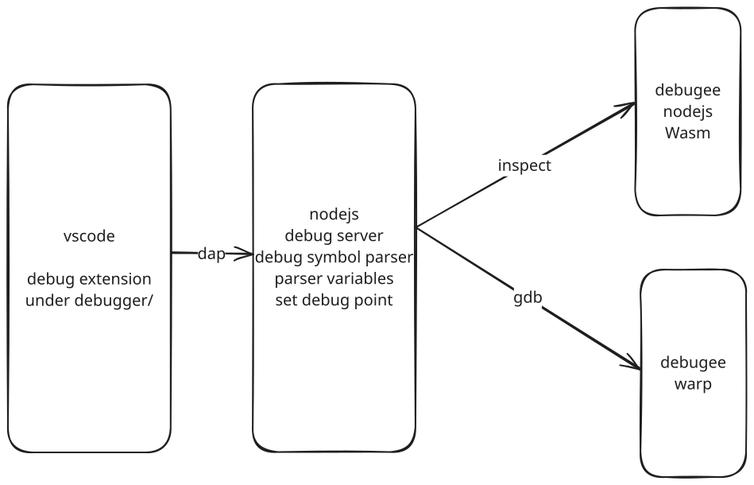

## User experience design

### 1. Launch a basic Wasm file

```json
{
  "type": "warpo",
  "request": "launch",
  "sessionMode": "wasm file",
  "wasmFilePath": "some/demo/path.wasm",
  "entryFunctionName": "foo",
  "args": [1, 2, 3]
}
```

Node Runtime:
In this case, the debugger server will:

1. Launch a subprocess with node inspect
2. use a internal js file to load the Wasm
3. run the export function.

Warp Runtime: TBD

### 2. Debug a unit test

The debugger starts the existing Warpo test runner in a Node process with the inspector enabled. The test runner itself still compiles the test module, supplies its usual imports, and executes the tests.

```json
{
  "type": "warpo",
  "request": "launch",
  "name": "Warpo Debug Unittest",
  "sessionMode": "unittest"
}
```

The debugger starts the Warpo CLI with `node dist/warpo.js test` under Node inspection. It uses the workspace folder as the test runner's working directory and loads debug metadata from `build_coverage/test.instrumented.wasm`.

Set `warpoPath` to use a Warpo CLI entry script outside `node_modules`; relative paths are resolved from the workspace folder.

```json
{
  "type": "warpo",
  "request": "launch",
  "sessionMode": "unittest",
  "warpoPath": "../warpo/dist/warpo.js"
}
```

### 3. Launch a Javascript file

```json
{
  "type": "js file",
  "jsFilePath": "some/demo/path.js"
}
```

Node Runtime:
In this case, the debugger server will:

1. Launch a subprocess with node inspect
2. run the given js file and wait for Wasm loaded event.
3. When a Wasm with warpo compatable debug symbol loaded, debugger will register this module for debugging

WARP runtime:
Not supported

### 3. Launch with a custom command

```json
{
  "type": "js file",
  "command": "some_command",
  "port": 1122 // with default value
}
```

Node runtime

```shell
export WARPO_DEBUG_PORT=1122
```

Unittest framework need to read this environment variable and run with inspect.

Restriction:
Integrator must pass the enviornment variable

Warp Runtime: TBD

## Topology

Topology of the debugger 
