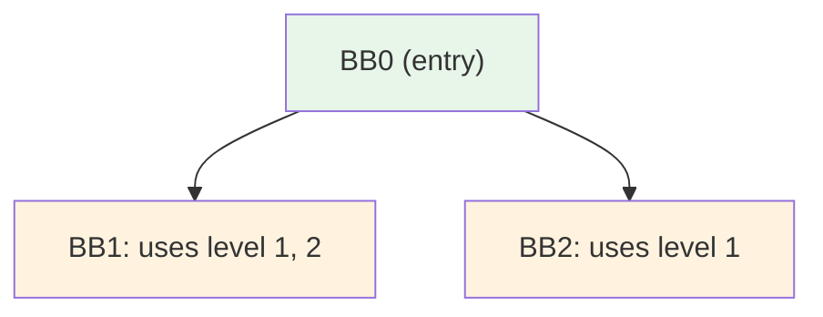
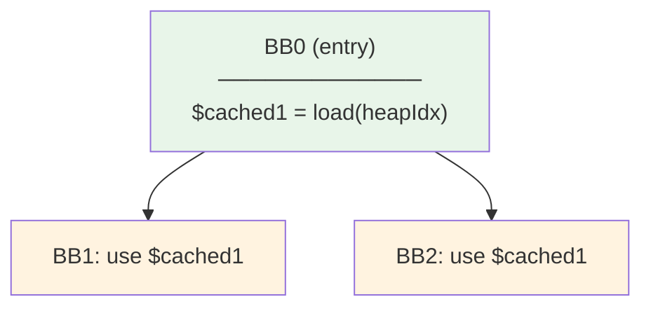
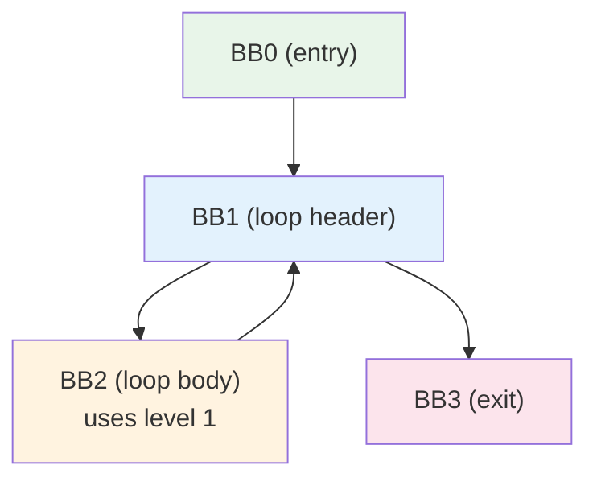
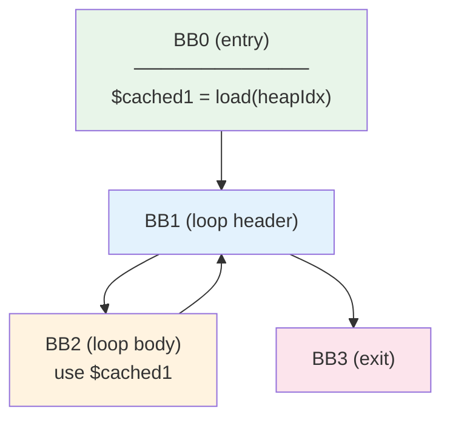
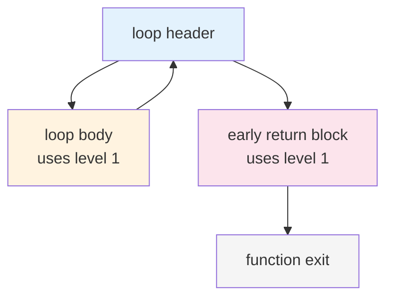

[[toc]]

# Closure Lowering

<p style="display: flex; gap: 10px;">
  
  
</p>

Closure lowering in warpo replaces the high-level closure environment runtime calls
(`getClosureEnv`, `setClosureEnv`, `getClosureEnvByLevel`) with concrete Wasm operations:
global accesses and chained memory loads.

This page covers the assumptions, the two lowering paths (fast and optimized), and the
optimization algorithm used in the optimized path.

The implementation lives in `passes/Closure.cpp` and `passes/Closure.hpp`.

## Background: Closure Environment Chain

When a function captures variables from outer scopes, the compiler allocates a **closure
environment** — a heap object that holds the captured values. For nested closures, environments
form a linked list: each environment stores a pointer to its parent.

```
level 0          level 1          level 2
┌──────────┐     ┌──────────┐     ┌──────────┐
│ env (cur) │ ──► │ env (par) │ ──► │ env (gp)  │
│ captured  │     │ captured  │     │ captured  │
└──────────┘     └──────────┘     └──────────┘
```

Accessing a variable captured at nesting level N requires N pointer dereferences (chained
`i32.load`). The **level** concept is central:

- **Level 0**: the current environment, stored in the `heapIdx` local (no load needed).
- **Level N** (N > 0): parent environment N hops away; requires N `i32.load` operations
  starting from level 0.

## Assumptions

### Frontend-emitted IR markers

The frontend (AssemblyScript compiler) imports three closure builtins:

| Import name                            | Signature      | Purpose                                 |
| -------------------------------------- | -------------- | --------------------------------------- |
| `~lib/rt/closure/getClosureEnv`        | `() → i32`     | Get current closure environment pointer |
| `~lib/rt/closure/setClosureEnv`        | `(i32) → void` | Set current closure environment pointer |
| `~lib/rt/closure/getClosureEnvByLevel` | `(i32) → i32`  | Get environment at nesting level N      |

There is also an FFI variant:

| Import name                             | Signature      | Purpose                           |
| --------------------------------------- | -------------- | --------------------------------- |
| `~lib/builtins/ffi.set_ffi_closure_env` | `(i32) → void` | Set environment for FFI callbacks |

### Global variable

Lowering materializes a mutable global `~lib/rt/closure/env` (i32) to hold the current
closure environment pointer. `getClosureEnv` / `setClosureEnv` are replaced with
`global.get` / `global.set` on this variable.

### `heapIdx` local

Each function that uses closures has a `heapIdx` local (provided by `VariableInfo`) that holds
the function's own closure environment pointer — this is level 0.

## Workflow Overview

Closure lowering runs during the lowering phase (see `passes/Runner.cpp`), before GC lowering
and after inline-decorator lowering. The path depends on optimization level:

```
lowering()
├─ InlinedDecoratorLower
├─ if optimizeLevel > 0 || shrinkLevel > 0:
│    closure::OptLower          ◄── optimized path
│    gc::OptLower
└─ else:
     closure::FastLower         ◄── fast path
     gc::FastLower
```

Both paths share common steps:

1. **Scan** — `ClosureCallScanner` checks if closure calls exist in the module.
2. **Common lowering** — `ClosureEnvCommonLower` replaces `getClosureEnv` / `setClosureEnv`
   with `global.get` / `global.set` on `~lib/rt/closure/env`.
3. **By-level lowering** — Replace each `getClosureEnvByLevel(N)` with chained loads.
4. **Cleanup** — `removeClosureImports` removes the imported function declarations.

Special case: if the module has `setClosureEnv` but no `getClosureEnv`, the set calls are
dead code and are removed by `SetClosureEnvRemover`.

## Fast Lowering (`closure::FastLower`)

Fast lowering performs no cross-block analysis. Each `getClosureEnvByLevel(N)` call is
replaced inline with N chained `i32.load` operations starting from the `heapIdx` local:

```wasm
;; getClosureEnvByLevel(3)
;; Before:
(call $~lib/rt/closure/getClosureEnvByLevel
  (i32.const 3))

;; After (fast):
(i32.load          ;; load 3
  (i32.load        ;; load 2
    (i32.load      ;; load 1
      (local.get $heapIdx))))
```

This is simple and correct but may generate redundant loads when the same or intermediate
levels are accessed multiple times.

## Optimized Lowering (`closure::OptLower`)

The optimized path caches intermediate level results in locals to avoid redundant
pointer-chasing. The key idea: if level 1 is needed to compute level 2, and both are
used in the same function, compute level 1 once, store it in a local, and reuse that
local for both the level 1 access and as the starting point for level 2.

The pass operates per-function and builds a CFG with a dominator tree to decide
**where** to place these cache stores.

### When to cache

Consider a function `inner` that accesses level 1 (parent) and level 2 (grandparent):

```ts
function inner(): i32 {
  return x + y; // x at level 2, y at level 1
}
```

Without caching (fast path), each access walks the full chain independently:

```
access y (level 1):  heapIdx ──load──► level 1
access x (level 2):  heapIdx ──load──► level 1 ──load──► level 2
                                       ^^^^^^^^
                                       redundant — same load as above
```

With caching, level 1 is stored in a local and shared:

```
cache:     heapIdx ──load──► $cached1        (one load)
access y:  $cached1                          (zero loads)
access x:  $cached1 ──load──► level 2        (one load)
                                        total: 2 loads instead of 3
```

The analysis decides to cache a level when:

- The same level is used **multiple times** in one basic block, or
- It is an **intermediate level** (a deeper level also exists, so the intermediate
  result would be computed anyway).

A level that is used only once and is the deepest level accessed — no sharing is
possible, so it is lowered inline without caching.

### Dominator-based placement

Once a level is marked for caching, the pass decides which basic block should hold the
cache store. The goal is to place it as early as possible so more downstream blocks benefit.

The pass walks up the dominator tree from the use site, looking for the highest block
that also has closure-related work:



BB0 dominates both BB1 and BB2. Both use level 1, so the cache store for level 1 is
**hoisted to BB0** — computed once, available to both branches:



### Loop-aware hoisting

Closure accesses inside a loop re-walk the same pointer chain every iteration, but the
environment pointer never changes. The pass hoists the cache store outside the loop:

```ts
function inner(n: i32): i32 {
  let sum: i32 = 0;
  for (let i = 0; i < n; i++) {
    sum += x; // x at level 1, accessed every iteration
  }
  return sum;
}
```



Level 1 is used in BB2 (loop body). Without hoisting, `load(heapIdx)` runs every
iteration. The pass hoists the cache to BB0, outside the loop:



Now the load executes once; every iteration just reads `$cached1`.

**Exception — loop exit blocks:** if a block inside a loop always exits (e.g. early
`return`), its code runs at most once, so hoisting provides no benefit:



Here, the "early return block" has no successor inside the loop — it always exits. Its
level 1 access is **not** hoisted out of the loop; it is handled by normal caching instead.

### Incremental chaining

Cache stores chain through intermediate levels rather than each level independently
walking from level 0:

```
To cache level 1 and level 2:

  $cached1 = load(heapIdx)       ← 1 load from level 0
  $cached2 = load($cached1)      ← 1 load from cached level 1
                                    total: 2 loads

Without chaining:

  $cached1 = load(heapIdx)                ← 1 load
  $cached2 = load(load(heapIdx))          ← 2 loads (redundant!)
                                            total: 3 loads
```

### Rewriting call sites

After analysis, each `getClosureEnvByLevel(N)` call is replaced with loads that start
from the nearest cached level instead of from level 0:

| Situation                    | Before                    | After                                                          |
| ---------------------------- | ------------------------- | -------------------------------------------------------------- |
| Level 1 cached in `$c1`      | `getClosureEnvByLevel(1)` | `local.get $c1`                                                |
| Level 1 cached, need level 2 | `getClosureEnvByLevel(2)` | `i32.load (local.get $c1)` — 1 hop instead of 2                |
| No cache available           | `getClosureEnvByLevel(2)` | `i32.load (i32.load (local.get $heapIdx))` — same as fast path |

### Example

Source:

```ts
function outer(): i32 {
  let x: i32 = 10;
  function middle(): i32 {
    let y: i32 = 20;
    function inner(): i32 {
      return x + y; // x is level 2, y is level 1
    }
    return inner();
  }
  return middle();
}
```

In `inner`, both `x` (level 2) and `y` (level 1) are accessed. The optimized lowering:

1. Caches level 1 in a local: `local.set $cached1 (i32.load (local.get $heapIdx))`
2. Rewrites `getClosureEnvByLevel(1)` → `local.get $cached1`
3. Rewrites `getClosureEnvByLevel(2)` → `i32.load (local.get $cached1)` (one load from cached level 1, instead of two from level 0)

```wasm
;; Optimized inner function (simplified):
(func $inner
  ;; Cache level 1 into $cached1
  (local.set $cached1
    (i32.load (local.get $heapIdx)))
  ;; Access y (level 1): use cached local
  (i32.load offset=4
    (local.get $cached1))
  ;; Access x (level 2): one load from cached level 1
  (i32.load offset=4
    (i32.load (local.get $cached1)))
  (i32.add))
```

### Loop hoisting example

When closure environment access happens inside a loop, the optimized path hoists the cache
store to a block before the loop:

```ts
function outer(): i32 {
  let sum: i32 = 0;
  function inner(n: i32): i32 {
    for (let i = 0; i < n; i++) {
      sum += i; // sum is level 1, accessed every iteration
    }
    return sum;
  }
  return inner(100);
}
```

Without loop hoisting, `i32.load (local.get $heapIdx)` runs every iteration. With loop
hoisting, the cache store is placed before the loop:

```wasm
;; Before loop:
(local.set $cached1
  (i32.load (local.get $heapIdx)))
;; Inside loop: uses $cached1 directly
(i32.load offset=4
  (local.get $cached1))
```
