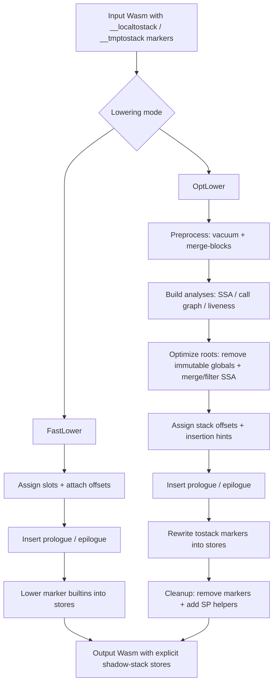

[[toc]]

GC lowering in warpo is a _shadow-stack lowering_ pass: it turns the GC MIR
(`~lib/rt/__localtostack` / `~lib/rt/__tmptostack`) into explicit stores to linear memory, and inserts
stack-pointer adjustments (prologue / epilogue) around the region where those roots must be visible to the collector.

This page is a high-level overview of the assumptions and the workflow implemented in `passes/GC/*`.

## Assumptions

GC lowering relies on the following runtime + IR conventions:

### Runtime symbols exist

The module is expected to contain:

- Globals
  - `~lib/memory/__stack_pointer` (i32): base pointer for the shadow stack region.
  - `~lib/memory/__data_end` (i32): lowest legal stack address (stack overflow check).
- Builtins used as IR markers
  - `~lib/rt/__localtostack`
  - `~lib/rt/__tmptostack`.
- Potential GC triggers (used for leaf-function classification)
  - `~lib/rt/itcms/__new`, `~lib/rt/itcms/__collect`, `~lib/rt/tcms/__new`, `~lib/rt/tcms/__collect`.

### Linear memory is available

Lowering writes roots into linear memory using the module’s first memory (`m->memories.front()`).

### `tostack` call shapes are constrained

The passes assume the frontend emits:

- `__tmptostack(v)` for temporary values (often as operands to `call` / `call_indirect`).
- `__localtostack(v)` for locals (typically used under `local.set`, i.e. `(local.set $x (call $__localtostack ...))`).

In the optimized path, `__localtostack` is assumed to be used only in `local.set` (other uses are treated
as invalid in analysis).

### Caller-managed arguments

warpo’s convention is that the _caller_ ensures the lifetime of GC-typed arguments across `call` and
`call_indirect`. GC lowering focuses on locals and temporaries that need to be rooted across _potential GC
trigger points_.

## Workflow

There are two main lowering modes:

- **Fast lowering** (`gc::FastLower`): minimal analysis, prioritizes compile time.
- **Optimized lowering** (`gc::OptLower`): uses liveness + CFG-based analyses to reduce shadow-stack traffic.

Both end up with the same essential shape in Wasm:

1. Reserve a per-function shadow-stack “frame” by adjusting `__stack_pointer`.
2. Replace `__localtostack` / `__tmptostack` with stores into that frame.
3. Restore `__stack_pointer` on all exits.

### Lowering pass flow



### stack-pointer helpers

GC lowering materializes two helper functions (see `passes/GC/BaseLower.cpp`):

- `~lib/rt/__decrease_sp(bytes)`
  - `__stack_pointer -= bytes`
  - `memory.fill(__stack_pointer, 0, bytes)` (clears newly allocated slots)
  - traps if `__stack_pointer < __data_end` (stack overflow / collision)
- `~lib/rt/__increase_sp(bytes)`
  - `__stack_pointer += bytes`

The explicit zeroing is important: it prevents stale pointers in unused slots from keeping objects alive.

### Fast lowering (`gc::FastLower`)

Fast lowering avoids CFG/liveness work and instead assigns slots with a simple, local strategy:

1. **Assign slots + attach offsets**
   - A walker scans the function and:
     - maps each local that goes through `__localtostack` to a stable slot.
     - allocates slots for `__tmptostack` values using a stack-like allocator that respects [nested calls](#nested-calls-in-fast-lowering).
   - It rewrites each `__localtostack(v)` / `__tmptostack(v)` to carry an extra operand: the byte offset
     (i.e. `4 * slotIndex`).
2. **Insert prologue/epilogue**
   - `PrologEpilogInserter` reserves `maxOffset` bytes at function entry (or at an equivalent safe point), and
     restores the stack pointer on all exits.
3. **Lower the builtins into real code**
   - The imported `__localtostack` / `__tmptostack` are turned into normal (non-imported) functions with
     signature `(value: i32, offset: i32) -> i32` that:
     - computes `address = __stack_pointer + offset`
     - stores `value` at `address`
     - returns `value`

This mode is fast and robust, but may reserve more space than strictly necessary.

#### Nested Calls in Fast Lowering

::: warning

It is possible to have nested call. We should make sure the slot of first argument is different with the second and the third.

```wasm
(call $foo
  (call $tostack (local.get $arg0))
  (call $bar
    (call $tostack (local.get $arg1))
    (call $tostack (local.get $arg2))
  )
)
```

:::

### Optimized lowering (`gc::OptLower`)

Optimized lowering runs a pipeline to minimize both reserved frame size and the number of stores.
For more detailed per-pass notes, see [opt_lower_details.md](opt_lower_details.md).

1. **Preprocess**
   - `vacuum` and `merge-blocks` (Binaryen passes) to reduce IR noise / block count.
2. **Remove obviously-unnecessary `tostack`**
   - `ImmutableGlobalToStackRemover` drops `__tmptostack(global.get $immutable)` because immutable globals
     don’t need re-rooting.
3. **Build SSA model for GC objects**

- A module-level SSA map is created over locals, temporaries, and parameters that are treated as GC objects.

4. **Compute call graph + leaf functions**
   - `CollectLeafFunction` marks functions that do _not_ (transitively) call `__new`/`__collect`.
5. **Object liveness analysis**
   - `ObjLivenessAnalyzer` computes a liveness bitset per expression for the SSA objects.
6. **SSA cleanup / merging**
   - `MergeSSA` can merge certain tmp-SSA values into the local-SSA they reference to reduce slots.
7. **Filter to “GC-relevant” regions**
   - `LeafFunctionFilter` invalidates SSA values that are never live around a _non-leaf_ call. Intuitively:
     if no GC can happen, there’s no reason to keep a root in the shadow stack.
8. **Assign stack offsets**
   - `StackAssigner` assigns offsets to the `tostack` sites where an SSA value becomes live.

- It builds a conflict graph from liveness and uses greedy coloring so
  non-overlapping lifetimes can reuse the same slot.

9. **Compute insertion hints for prologue/epilogue**
   - `ShrinkWrapAnalysis` chooses insertion points (dominating / post-dominating all required stack activity)
     and avoids loops.
10. **Insert prologue/epilogue**

- `PrologEpilogInserter` uses the computed max offset and insertion hints; it also rewrites
  `return` sites to ensure the epilogue executes on early returns.

11. **Inline `tostack` into stores (or remove it)**
    - `ToStackReplacer` replaces `__localtostack` / `__tmptostack` with an `i32.store` into
      `__stack_pointer + offset`, returning the original value.
    - If a call has no assigned offset, it is dropped (the value is used directly).
12. **Cleanup**
    - Removes the marker functions `__localtostack` / `__tmptostack` from the module and adds the
      stack-pointer helpers.
