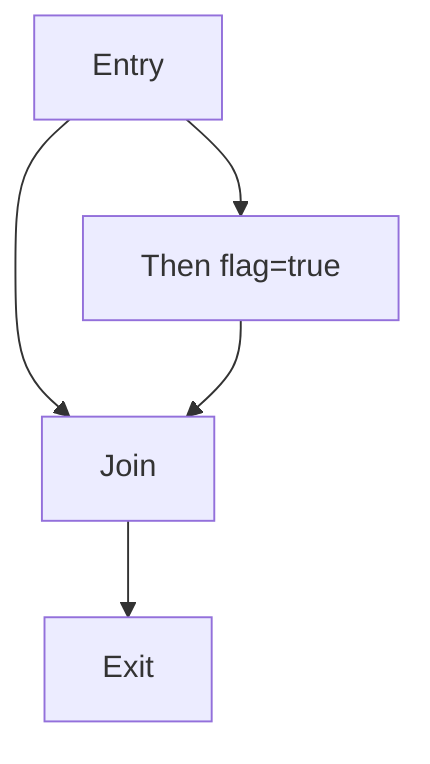

[[toc]]

Quick references:

- Shadow stack: [/en/using_runtime/shadow_stack](/en/using_runtime/shadow_stack)

# Opt Lowering

`gc::OptLower` (`passes/GC/OptLower.cpp`) is a more complex GC lowering pipeline. It builds an SSA model for GC objects, runs liveness analysis on the CFG, assigns shadow-stack slots based on alive ranges, and can also do shrink wrap. Shrink wrap tries to move the prologue/epilogue close to the region where the shadow stack is really needed.

Compared with `gc::FastLower`, the optimized pipeline costs more time, but it usually achieves:

- A smaller shadow-stack frame.
- Fewer `tostack` stores (many sites can be proven “no need to tostack” and then removed).

The sections below follow the pass order in `OptLower::run()`.

## Thought Exercise: Precisely Compute `new` Object Lifetimes

Consider the simplified AssemblyScript code below, and try to precisely mark the lifetime interval (start and end) of each object created by `new`.

```ts
class Node {
  constructor(id: i32) {}
}

declare function use(n: Node): void;

export function demo(flag: bool): i32 {
  let a = new Node(1);
  let b = new Node(2);
  if (flag) {
    let c = new Node(3);
    use(c);
    use(b);
    a = c;
  }
  use(a);
  return 0;
}
```

::: details Analysis Framework

Use a lightweight dataflow workflow. The goal is to separate "variable flow" from "object lifetime" and make each step checkable.

1. Build the CFG for this exact shape



2. Label program points and classify facts

- Definitions on variables:
  - `d1: a = new Node(1)`
  - `d2: b = new Node(2)`
  - `d3: c = new Node(3)` (inside `Then`)
  - `d4: a = c` (inside `Then`)
- Uses:
  - `u1: use(c)`
  - `u2: use(b)`
  - `u3: use(a)`
- Distinguish two layers:
  - Variable definitions (`a`, `b`, `c`)
  - Allocation sites (`O1`, `O2`, `O3` from the three `new` calls)

3. Run Reaching Definitions (forward) for variables

- Dataflow equations:
  - `IN[B] = ∪ OUT[P]` over predecessors `P`
  - `OUT[B] = GEN[B] ∪ (IN[B] - KILL[B])`
- Key point in this updated code: `a` has multiple reaching defs (`d1` and `d4`) at `Join`.
- Use this result to answer: at `u3: use(a)`, which defs of `a` may reach?

4. Run Variable Liveness (backward)

- Dataflow equations:
  - `OUT[B] = ∪ IN[S]` over successors `S`
  - `IN[B] = USE[B] ∪ (OUT[B] - DEF[B])`
- Compute live-before/live-after for `a`, `b`, `c` at least around `u1/u2/u3` and `d4`.
- Pay attention to branch sensitivity: `c` is only in `Then`, but its value can flow to `a` through `d4`.

5. Lift from variable flow to object lifetimes

- Object lifetime starts:
  - `O1` starts after `new Node(1)`
  - `O2` starts after `new Node(2)`
  - `O3` starts after `new Node(3)`
- Object lifetime ends are determined by the last reachable use of any variable aliasing that object.
- Because `a = c`, the final `use(a)` may refer to `O1` (false path) or `O3` (true path). This is the core join-point case.

:::

## Preprocess: `vacuum` / `merge-blocks` (Binaryen)

#### Rationale

Most analyses in optimized lowering depend on the CFG, the dominator tree, and the number of basic blocks. This step reduces IR “noise” and merges blocks, which lowers later analysis cost and avoids too many fixed address computations.

#### Method

`OptLower::preprocess()` adds two Binaryen passes into `wasm::PassRunner`:

- `vacuum`: removes useless IR.
- `merge-blocks`: merges basic blocks and reduces block count.

#### Example

This is a Binaryen cleanup step, so the exact output depends on surrounding IR. Conceptually, it removes empty/dead constructs and merges trivial blocks:

Before (illustrative):

```wasm
(func $f
  block ;;none
    block ;;none
      ;; empty / dead block
    end
    ;; other IR
  end
)
```

After `vacuum` + `merge-blocks` (illustrative):

```wasm
(func $f
  block ;;none
    ;; other IR
  end
)
```

## `ImmutableGlobalToStackRemover`

#### Rationale

The pattern `__tmptostack(global.get <immutable global>)` is usually not needed. An immutable global is not lost because of GC and is not modified. Writing it to the shadow stack only adds extra stores and increases frame cost.

#### Method

Scan the function for temporary-root markers that simply forward an immutable global value.

- Use `VariableInfo` (or equivalent metadata) to decide whether the referenced global is immutable.
- If it is immutable, drop the marker and keep the underlying value expression, avoiding an unnecessary shadow-stack store.

#### Example

Immutable global: the marker is removed, so there is no shadow-stack prologue/store around it.

Before (immutable global routed through marker):

```wasm
(func $.../_start
    global.get $.../a ;; immutable
  call $~lib/rt/__tmptostack
    global.get $.../a
  call $.../bar
)
```

After (marker removed):

```wasm
(func $.../_start
    global.get $.../a
  call $.../bar
)
```

Mutable global: the store is preserved, and the function maintain shadow stack.

Before (mutable global must be rooted across call):

```wasm
(func $.../_start
    global.get $.../a ;; mutable
  call $~lib/rt/__tmptostack
    global.get $.../a ;; mutable
  call $.../bar
)
```

After (marker lowered to prologue/store/epilogue):

```wasm
(func $.../_start
  block ;;none
      i32.const 8
    call $~lib/rt/__decrease_sp
      block ;;i32
          global.get $~lib/memory/__stack_pointer
          global.get $.../a
        i32.store $0 align=1
        global.get $.../a
      end
    call $.../bar
      i32.const 8
    call $~lib/rt/__increase_sp
  end
)
```

## `CallGraphBuilder`

#### Rationale

“May this call trigger GC?” is a key condition for many optimizations. If a call and everything it can reach will never trigger `__new/__collect`, then keeping shadow-stack roots around it is useless.

#### Method

Collect a module-level call graph (who may call whom) and pass it to later analyses that need to reason about reachability of GC trigger points.

#### Example

`CallGraphBuilder` is analysis-only, so it does not directly change WAT by itself. Its impact is visible in later filtering passes that treat calls differently based on whether they can reach GC triggers.

For a concrete “visible effect”, see the `LeafFunctionCollector` / `LeafFunctionFilter` examples below.

## `LeafFunctionCollector` (`GCLeafFunction`)

`GCLeafFunction` is an analysis pass (not a transform pass). It computes a per-function classification:

- **non-leaf**: this function may trigger GC through its transitive callees.
- **leaf**: this function cannot reach GC trigger points through any call chain.

The result is metadata used by later passes (mainly `LeafFunctionFilter`), so this pass does not directly rewrite WAT by itself.

#### Rationale

GC trigger points (`~lib/rt/*/__new`, `~lib/rt/*/__collect`) decide which functions can trigger GC (directly or indirectly). If we can find functions that will not trigger GC, later filtering can be stronger: keep roots only around calls that may trigger GC.

#### Method

Do a reverse reachability marking on the call graph:

- Start from known runtime GC trigger entrypoints (allocation / collection).
- Mark all functions that can reach those entrypoints (transitively) as **non-leaf**.
- The remaining functions are treated as **leaf** (cannot trigger GC through any call chain).
- Emit this classification for later filtering passes to decide which call sites must be treated as potential GC points.

## `ObjLivenessAnalyzer`

#### Rationale

The core idea is: “a root is needed only if the object is still alive at a possible GC point”. To do this, we need the object liveness range (before/after) of each GC-object SSA value on the CFG.

A simple way to understand **object liveness range**:

```wasm
  call $__new_obj ;; definition of object value
local.set $obj    ;; create a reference point to this object
call $foo         ;; possible GC point
  local.get $obj
call $bar         ;; last use
```

For this value, the object liveness range starts after `call __new_obj` and ends at `call $bar`. Because `call $foo` is inside that interval, `$obj` is alive at the call, so it may need a root there.

#### Method

Build an SSA-like model for “GC-object values that may need rooting”, then compute where each such value is alive on the CFG.

1. **Define the SSA index space**
   - Identify the IR constructs that represent “values that participate in rooting”, and assign each one a stable SSA index (a unique numeric ID in the liveness bitset/index space).

   - In the current implementation (`passes/GC/SSAObj.cpp` / `passes/GC/SSAObj.hpp`), there are exactly three SSA value kinds:
     - `Arg SSA` (function parameter index):
       `i32` parameters are inserted as SSA values at function entry.
       Reason: parameters can be caller-managed object references into the callee; they must stay alive according to GC calling convention. Identify them may be helpful for further optimization.

     - `Local SSA` (`local.set` whose value is `call ~lib/rt/__localtostack`):
       only this shape is inserted as a `Local SSA` definition.
       Reason: this is the explicit IR marker saying “this local-backed object value participates in rooting”, so it should own a liveness index.

     - `Tmp SSA` (`call ~lib/rt/__tmptostack`):
       the call expression itself is inserted as a `Tmp SSA` definition.
       Reason: some rooted object values are expression-temporaries (not bound to a local); they still need a trackable SSA index for liveness.

2. **Compute liveness on the CFG**

- Use dataflow analysis to determine which SSA indices are alive before/after key program points.
- Here, **key program points** means expression sites explicitly tracked in `LivenessMap` by `ObjLivenessAnalyzer` (`passes/GC/ObjLivenessAnalyzer.cpp`):
  - `local.set` and `local.get` (where object references are defined/read through locals)
  - `call` and `call_indirect` (potential GC-relevant boundaries)
  - extra parent use sites of `__tmptostack(...)` values (including function-return use), so temporary rooted values also have observable liveness boundaries
- `LivenessMap` is the per-function table that stores liveness snapshots for those expression sites (`passes/GC/Liveness.hpp`).
  - Logical key: `(expr, pos, ssaIndex)` where `pos` is `Before` or `After` expression.
    Expression execution is a status modifying stage, but it is not a point. We cannot say ssa is alive or not alive during this stage, we can only say ssa is alive or not alive before / after expression.
  - Logical value: `isLive` (`bool`).
- Record this compact `before`/`after` representation (`LivenessMap`) for later filtering and slot assignment.

#### Example

see [ObjLivenessAnalyzer example](examples/gc_opt_liveness_example.md).

## `MergeSSA`

#### Rationale

Many `Tmp SSA` values are just a “move/reference” of an existing value in `Local SSA` (for example, `__tmptostack(local.get ...)`). If we merge such `Tmp SSA` values into `Local SSA`, we reduce the SSA size and can further reduce the needed slot count.

#### Method

Coalesce “pure forwarding” `Tmp SSA` into the underlying `Local SSA` source.

- Use `LivenessMap` to resolve which source SSA dimension is alive at the forwarding site.
- Merge the temporary alive range into the source alive range.
- Mark the temporary dimension as invalid.

Bit view (column-wise): think of each SSA dimension as one bit column over tracked program points.

- `1` means alive at that point, `0` means not alive.
- A forwarding `Tmp SSA` is mergeable into a `Local SSA` when their overlap check is consistent with “same value flow” at that site.

Example matrix:

| Program point | Local SSA `L0` | Tmp SSA `T0` |
| ------------- | -------------- | ------------ |
| p0            | 1              | 0            |
| p1            | 1              | 1            |
| p2            | 0              | 1            |
| p3            | 0              | 0            |

Columns as bit vectors (top to bottom `p0..p3`):

- `L0 = 1100`
- `T0 = 0110`

After merging SSA, `T0` is alignment of `L0`, so we only need to tracking `L0`.

- `L0 = 1100 | 0110 = 1110`
- `T0 = invalid`

#### Example

When a `Tmp SSA` value is just forwarding an existing alive `Local SSA` value, merging SSA can reduce frame size and remove redundant stores.

Before (temporary forwarding SSA keeps extra slot pressure):

```wasm
;; frame size: 12
i32.const 12
call $~lib/rt/__decrease_sp

global.get $~lib/memory/__stack_pointer
local.get $x
i32.store $0 offset=4 align=1

global.get $~lib/memory/__stack_pointer
local.get $x ;; forwarded temp uses another slot
i32.store $0 offset=8 align=1
```

After (forwarding SSA merged; redundant store dropped):

```wasm
;; frame size: 8
i32.const 8
call $~lib/rt/__decrease_sp

... ;; one store remains
global.get $~lib/memory/__stack_pointer
local.get $...
i32.store $0 offset=4 align=1

... ;; a later forwarding-store is removed
```

## `LeafFunctionFilter`

#### Rationale

If an SSA object is alive only around leaf calls, then even if it is alive, it will not meet a real GC trigger point. Such a root can be removed, which reduces shadow-stack pressure.

#### Intuition (visual)

Use the following picture to read the rule quickly:

- Vertical line (`|`): one object's liveness range.
- Horizontal solid line (`====`): a program point that may trigger GC.
- Horizontal dashed line (`----`): a program point irrelevant to GC.
- Intersection on a solid line (`X`): this object must be root.

```text
program points (top -> bottom)

           ObjA   ObjB
p0  ---- ----|----|----
p1  ---- ----|----|----
p2  ---- ----|---------
p3  ==== ====X=========

Decision:
- ObjA intersects a solid line at p3 -> keep root.
- ObjB intersects only dashed lines -> root can be removed.
```

#### Method

Filter the liveness model to keep only roots that matter at potential GC trigger points.

- Treat **non-leaf direct calls** and **all indirect calls** as potential GC trigger points.
- Collect the set of SSA dimensions that are alive at those points.
- Invalidate all other SSA dimensions so they do not affect slot assignment or shrink-wrapping decisions.

#### Example

If an object is alive only around leaf calls (no reachable GC trigger), leaf filtering can remove the shadow-stack management entirely:

Before (conservative rooting around call):

```wasm
(func $.../_start (result i32)
  ...
  i32.const 4
  ;; start liveness of $obj
  call $~lib/rt/__decrease_sp
  global.get $~lib/memory/__stack_pointer
  local.get $obj
  i32.store $0 align=1
  ;; end liveness of $obj
  call $.../constructor ;; leaf-only path
  i32.const 4
  call $~lib/rt/__increase_sp
  return
)
```

After (shadow-stack ops removed):

```wasm
(func $.../_start (result i32)
  ...
  call $~lib/rt/itcms/__new
  call $.../constructor
  ;; no __decrease_sp / no i32.store rooting / no __increase_sp
  return
)
```

## `StackAssigner`

#### Rationale

After we know “which SSA values become alive at which points”, we need to map these “become-alive `tostack` sites” to concrete shadow-stack offsets (slot/offset). A better assignment lets non-conflicting objects (no overlap in lifetime) reuse the same slot, which reduces the frame size, and even can reduce the peak ram usage.

#### Method

Assign concrete shadow-stack slots (offsets) to the remaining SSA dimensions based on their alive ranges.

- Detect the program points where an SSA dimension first becomes alive.
- Associate those “become-live” sites with the corresponding rooting marker.
- Choose an offset for each marker and record it as the stack position.

There are two strategies:

- **Vanilla**: when an SSA value is first seen, assign a new slot (simple but can be large).
- **GreedyConflictGraph**: build a conflict graph from `LivenessMap` and then do greedy graph coloring (more compact).

  High level idea:
  - Two SSA dimensions conflict if they are simultaneously alive at any tracked program point.
  - Build a conflict graph and greedily color it so conflicting dimensions do not share a color.
  - Map colors to slots (each color corresponds to one shadow-stack slot).

  Notes / tradeoffs:
  - This is a heuristic (graph coloring is NP-hard), but typically much more compact than **Vanilla**.
  - Building the conflict graph is roughly quadratic in the number of SSA values (the current implementation uses an adjacency matrix), so earlier passes try hard to keep the SSA space small.

#### Example

Slot reuse shows up as a much smaller frame size and many stores targeting the same slot (offset 0):

Before (distinct slots, larger frame):

```wasm
;; frame size: 24
i32.const 24
call $~lib/rt/__decrease_sp

global.get $~lib/memory/__stack_pointer
local.get $a
i32.store $0 offset=0 align=1

global.get $~lib/memory/__stack_pointer
local.get $b
i32.store $0 offset=8 align=1

global.get $~lib/memory/__stack_pointer
local.get $c
i32.store $0 offset=16 align=1
```

After (slot reuse, compact frame):

```wasm
;; frame size: 4
i32.const 4
call $~lib/rt/__decrease_sp

... ;; multiple roots reusing the same slot
global.get $~lib/memory/__stack_pointer
local.get $...
i32.store $0 align=1

... ;; later root also uses offset 0
global.get $~lib/memory/__stack_pointer
local.get $...
i32.store $0 align=1

i32.const 4
call $~lib/rt/__increase_sp
```

## `ShrinkWrapAnalysis`

#### Rationale

Putting the prologue/epilogue at function entry/exit is the simplest choice, but many functions need the shadow stack only on some paths. Shrink wrapping moves the “open stack / close stack” to the region that really needs it, which reduces useless `__decrease_sp/__increase_sp` calls.

#### Method

For each function, decide the minimal region where the shadow stack must be active.

- Use the computed liveness to decide which basic blocks contain at least one point that needs rooting.
- Exclude caller-managed parameters from this decision.

Then pick insertion points using control-flow structure:

- A prologue must dominate all blocks that need an active shadow stack.
- An epilogue must post-dominate all such blocks (or be placed on the exit path).
- Avoid placing prologue/epilogue inside loops to prevent repeated stack-pointer updates.

The output is an `InsertPositionHint { prologueExpr, epilogueExpr }` for each function.

#### Example

Shrink wrapping can move the prologue into the region that actually needs roots. In this snapshot, `__decrease_sp` is inserted only on the path that allocates/roots, while an early return path avoids touching the shadow stack:

Before (prologue at entry, even early-return path pays cost):

```wasm
(func $.../_start (param i32) (result i32)
  i32.const 8
  call $~lib/rt/__decrease_sp
  ...
  if
    ...
    i32.const 8
    call $~lib/rt/__increase_sp
    return
  end
  ...
)
```

After (prologue only on path that needs roots):

```wasm
(func $.../_start (param i32) (result i32)
  ...
  if
    ...
    return        ;; early return, no __decrease_sp
  end

  block ;;i32
        i32.const 8
      call $~lib/rt/__decrease_sp
    ... ;; allocation + stores
  end
  ...
)
```

## `PrologEpilogInserter`

#### Rationale

In the end we must guarantee: if a function has any shadow-stack store, it must execute `__decrease_sp(frameSize)` on all paths before the stores, and execute `__increase_sp(frameSize)` on all return paths. Otherwise the shadow stack will be wrong.

#### Method

Compute the required frame size from the assigned stack positions, then ensure stack-pointer adjustments are correct on all paths.

- If shrink-wrap hints are available and insertion is legal, insert “open shadow stack” near the first needed point and “close shadow stack” near the last needed point.
- Otherwise, fall back to a conservative scheme that opens at function entry and closes on all return paths.

#### Example

On early returns, the inserter ensures the epilogue runs before returning:

Before (missing epilogue on return path):

```wasm
... ;; rooted region
local.set $ret
local.get $ret
return
```

After (epilogue guaranteed before return):

```wasm
... ;; rooted region
local.set $ret
i32.const 4
call $~lib/rt/__increase_sp
local.get $ret
return
```

## `ToStackReplacer`

#### Rationale

The earlier steps decide (in analysis/assignment) which `tostack` markers to keep and what offsets they use. Finally, we must turn IR markers (`__localtostack/__tmptostack`) into real `i32.store`, and delete markers that are not needed, so later wasm optimizations can work.

#### Method

Lower rooting markers into concrete memory stores and remove markers that were proven unnecessary.

- If a marker has no assigned stack slot, replace it with its underlying value expression.
- If a marker has an assigned slot, emit a store to the shadow stack at that offset while preserving the original value as the expression result.
- Ensure the rooted value is eval only once (introducing a temporary local only when expression is complex).

#### Example

After replacement, a marker typically becomes a store to `__stack_pointer` plus the original value flow (excerpt):

Before (marker form):

```wasm
call $~lib/rt/__tmptostack
  local.get $obj
```

After (concrete store + value flow):

```wasm
global.get $~lib/memory/__stack_pointer
local.get $obj
i32.store $0 offset=4 align=1
local.get $obj
```

## Post-lowering (cleanup + helper functions)

#### Rationale

After lowering, `__localtostack/__tmptostack` should not stay as imports/markers. We also need shared SP helpers, so the allocated shadow-stack region is cleared and has an overflow check.

#### Method

`OptLower` does module-level cleanup after `runner.run()`:

- `removeFunction("~lib/rt/__localtostack")`
- `removeFunction("~lib/rt/__tmptostack")`
- `addStackStackOperationFunction(m)` injects:
  - `~lib/rt/__decrease_sp(bytes)`
    - `__stack_pointer -= bytes`
    - `memory.fill(__stack_pointer, 0, bytes)`
    - `unreachable` when `__stack_pointer < __data_end`.
  - `~lib/rt/__increase_sp(bytes)`:
    - `__stack_pointer += bytes`.

#### Example

After module-level cleanup, marker functions are removed and shared SP helpers are present in the module. The helper function bodies look like (excerpt):

```wasm
(func $~lib/rt/__decrease_sp (param i32)
  ...
  global.get $~lib/memory/__stack_pointer
  local.get $0
  i32.sub
  global.set $~lib/memory/__stack_pointer
  ...
  memory.fill
  ...
)

(func $~lib/rt/__increase_sp (param i32)
  ...
  global.get $~lib/memory/__stack_pointer
  local.get $0
  i32.add
  global.set $~lib/memory/__stack_pointer
)
```
